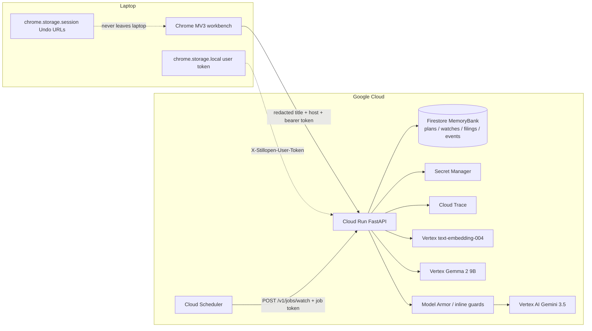

# Still Open architecture

*Hackathon: All Things Agentic — Taskmaster track.*

Gemini 3.5 on Vertex, an ADK SequentialAgent graph (`clerk → runner → verifier`),
Firestore MemoryBank, Cloud Run + Cloud Scheduler + Cloud Trace + Model Armor.
Every write is bounded by a gateway policy; every plan is replayable from an
append-only audit trail.

## The done-path is agentic, not a shortcut

When the user hits **Done, close!** the extension calls `POST /v1/tasks/finish`.
The API runs the ADK graph end-to-end for every durable task:

1. **Surveyor** (Python) redacts titles + URLs into `SanitizedTab`s.
2. **Framer** builds a `Plan` (cards: `FILE` / `WATCH` / `FINISH` / `DECIDE` / `KILL`) and stamps `CloseHint.NEVER` on protected hosts.
3. **Clerk** (ADK `LlmAgent`, `gemini-3.5-flash`) drafts artifacts. User notes ride into the prompt with a preserve-verbatim instruction, and a Python guard rebuilds any missing "Notes from the user" section so the LLM can't rewrite the user's words.
4. **Runner** (Python-only tools) files each artifact into the `FilingStore` — a Firestore-backed `GoogleWorkspace` implementation that produces a public `/v1/filings/{id}` URL so judges can inspect what was written.
5. **Verifier** (Python) re-reads every artifact, compares to `Plan`, and either emits a `TabApply` (green-lighting the extension close) or holds the tabs open.
6. **Auditor** (`stillopen_core.observability.audit`) writes a `PlanEvent` for every phase — `proposed → clerk_draft → runner_file → verifier_ok → close_applied`. `GET /v1/plans/{id}/audit` returns the whole chain.
7. **Watch enrol** (`POST /v1/tasks/still-going`) turns "I'm not done, remind me" into hash-only `Watch`es that Cloud Scheduler ticks every 5 minutes.

Ephemeral one-tab lookups still short-circuit the LLM path (`clerk="skipped"`)
but still emit a `close_applied` audit event so the transparency story is
uniform.

## Agents & tool isolation

| Agent | Runtime | Tools (gateway allowlist) | Must not |
|---|---|---|---|
| Surveyor | Python | `sanitize_snapshot` | Call Gemini |
| Framer | Python | `plan_from_tabs` | Draft artifacts |
| Cluster / chat / categorize | Vertex Gemini 3.5 | `generate_json` | Create Docs |
| Clerk | ADK `LlmAgent` | `draft_artifact` | Execute writes |
| Runner | Python | `create_doc`, `create_event`, `create_task`, `emit_tab_apply` | Close tabs |
| Verifier | Python | `get_doc`, `get_event`, `write_undo` | Invent artifacts |
| Task-labeler | Vertex Gemma 2 (optional) | `label_task` | See tab URLs / sensitive titles |
| Embedder | Vertex `text-embedding-004` (optional) | `embed_tab` | See PII beyond the sanitised title |
| Watch | Cloud Scheduler → Cloud Run | hash-only fetch | Store page HTML |

The registry is not documentation — it's `GET /v1/agents/registry`, which
introspects `RUN_GRAPH` and the loaded `GatewayPolicy` at boot. Tools and
per-agent rate limits come straight from code so the registry cannot drift.

## State & lifecycle

- **Plans** are versioned by `plan_id` with a `status` machine (`PROPOSED → RUNNING → SUCCEEDED/FAILED`).
- **PlanEvents** are append-only per plan, capped at 200 rows (older events roll off), each stamped with `agent`, `phase`, `verdict`, and a redacted `summary`.
- **Filings** live in Firestore under `filings/{id}` and are surfaced via a signed public URL (the URL is stable but only readable through the API, so IAM controls listing).
- **Watches** are hash-only. We never store the fetched HTML; only the `sha256(body)` and a `last_seen_at`.
- **UndoRows** (original URLs) stay in `chrome.storage.session`. They are wiped when the extension is uninstalled and never leave the laptop.

## Scalability

- Cloud Run auto-scales; MemoryBank picks between Firestore (cloud) and local JSON (dev) via `settings.use_firestore` — the same `MemoryBank` interface, so nothing calling code needs to branch.
- Embeddings are cached per tab hash. Turning on `STILLOPEN_USE_VERTEX_EMBEDDINGS=1` swaps the `HashEmbedder` for `VertexEmbedder` without changing consumers.
- Gemma calls are opt-in (`STILLOPEN_GEMMA_MODEL=gemma-2-9b-it`) and scoped to one narrow prompt (`suggest_task_label`) so we don't blow past quota on the primary Gemini path.
- Watch fan-out is bounded by Cloud Scheduler cadence + per-tick budget; every fetch is `hash_only_fetch` in cloud (never `fetch_forbidden`, which is the local kill-switch).

## Security

- **Redaction first**: `SanitizedTab` drops query strings, path segments deeper than 2, and any host on the deny list (bank / health / gov / school / auth) before a model ever sees the tab.
- **Model Armor** (`STILLOPEN_MODEL_ARMOR_TEMPLATE`) wraps every prompt and every response; the inline guards run either way, so removing the template still catches obvious prompt injection.
- **Per-user bearer token**: the extension registers once at install (`POST /v1/auth/register`), stores the plaintext token in `chrome.storage.local`, and the server keeps only its SHA-256 hash. When `STILLOPEN_REQUIRE_USER_TOKEN=1`, `X-Stillopen-User-Token` is required on `/v1/tasks/finish` and `/v1/tasks/still-going`; a mismatch is a 401.
- **Job token**: Cloud Scheduler proves it's Cloud Scheduler via `X-Stillopen-Job-Token`; a rotating value stored in Secret Manager.
- **Secret Manager** hydrates `STILLOPEN_JOB_TOKEN` and `GOOGLE_API_KEY` at boot; secrets are never in env files.
- **CORS** is a Chrome-extension regex, so a stolen token in a browser tab still cannot make the write.
- **Server-derived intent**: the "should I run Clerk?" decision uses the Framer's `infer_intention` on the sanitized tabs — never the client's self-reported `intention`/`kind`. A hostile caller can't force a filing by claiming `intention="comparing"`, and can't skip filing on a comparison by claiming `intention="unknown"`. Only an explicit `file_to_google` opt-in is honored.
- **Verifier fidelity**: existence is not enough. For every `FILE`/`DECIDE` card the Verifier reads the filed body via `GoogleWorkspace.read()` and requires (a) at least one of the card's tab hosts appears in the body — a citation — and (b) any user-supplied notes appear verbatim. If either fails the plan degrades to `close_tab_ids = []` and tabs stay open. This closes the honest gap that a hallucinating Clerk could pass by producing *some* Doc.

## Auditability

- Every plan has a full trace: `GET /v1/plans/{id}/audit` returns `PlanEvent`s in order.
- Every filing has a permalink: `GET /v1/filings/{id}` renders the exact bytes the Clerk drafted, with citations back to the source URLs.
- Cloud Trace spans wrap every ADK subagent (via `stillopen_core.observability.tracing`).
- The registry is the source of truth for which tools each agent may call.

## Data that never reaches a model

Bank / health / gov / school / auth hosts: `blocked_from_model`. Tab titles are
untrusted data (`TITLE_IS_DATA` + inline Model Armor). Original Undo URLs stay
in `chrome.storage.session`. User notes are marked *trusted content, preserve
verbatim* in the Clerk prompt and re-enforced by the Python `ensure_user_notes`
guard so a hallucinating LLM can't quietly rewrite them.
