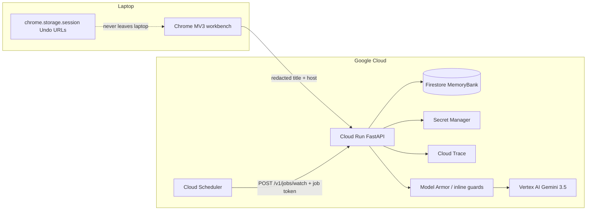

"""System architecture — All Things Agentic (Taskmaster).

Judges: this is the production topology. Gemini 3.5 on Vertex, ADK Clerk,
Cloud Run + Firestore + Cloud Scheduler, gateway-enforced tools.
"""

# Still Open architecture

## Agents and isolation

| Agent | Runtime | Tools (gateway allowlist) | Must not |
|---|---|---|---|
| Surveyor | Python | `sanitize_snapshot` | Call Gemini |
| Cluster / chat / categorize | Gemini 3.5 via Vertex | `generate_json` | Create Docs |
| Clerk | ADK `LlmAgent` | `draft_artifact` | Execute writes |
| Runner | Python | `create_doc`, `create_event`, `create_task`, `emit_tab_apply` | Close tabs |
| Verifier | Python | `get_doc`, `get_event`, `write_undo` | Invent artifacts |
| Watch | Cloud Scheduler | hash-only fetch | Store page HTML |

Live File (`run_plan`: Clerk → Runner → Verifier) is still in the API for the ADK graph and Watch tests. The workbench done-path is notes, then close.

## Mandatory stack (Stage One)

| Requirement | Where |
|---|---|
| Gemini 3.5+ | `STILLOPEN_FAST_MODEL=gemini-3.5-flash` on Vertex (`GOOGLE_GENAI_USE_VERTEXAI=true`) |
| Google ADK | `packages/core/.../agents/adk_clerk.py`, `adk_graph.py` SequentialAgent clerk→runner→verifier |
| GCP services | Cloud Run (API), Firestore (MemoryBank), Cloud Scheduler (Watch), Cloud Trace (OTEL), Secret Manager |

## Data that never reaches a model

Bank / health / gov / school / auth hosts: `blocked_from_model`. Tab titles are untrusted data (`TITLE_IS_DATA` + inline Model Armor). Original Undo URLs stay in `chrome.storage.session`.
